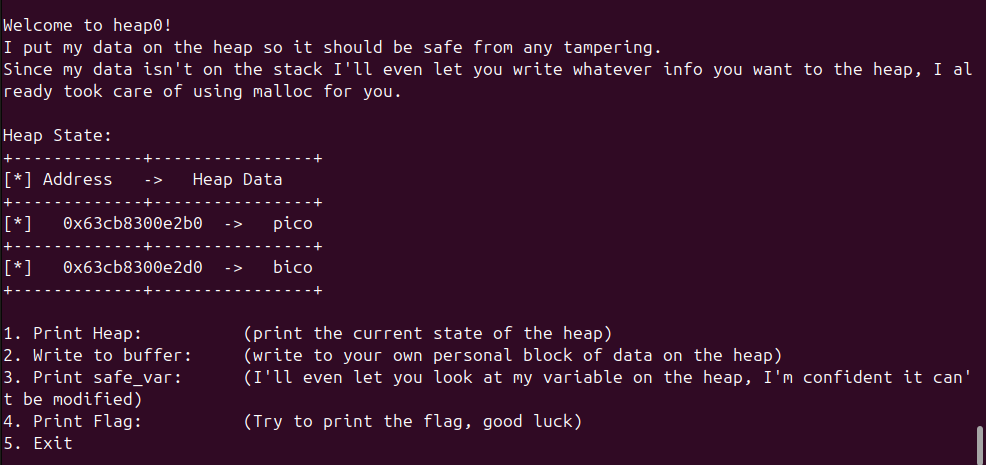
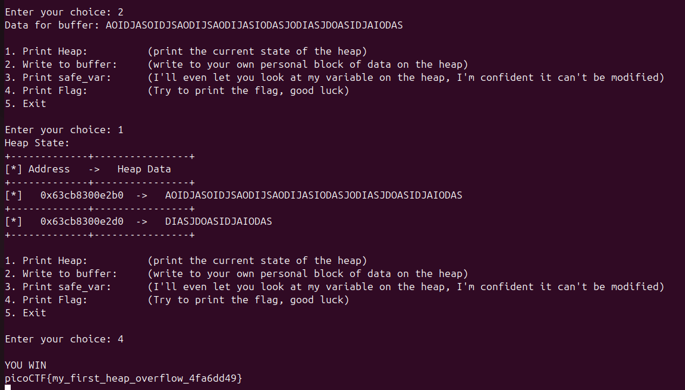

To complete this challenge you have to perform a heap overflow, which targets dynamically allocated memory instead of on the stack. 

2 variables on the heap: input_data and safe_var, and to win, you have to change safe_var

Vulnerability in code here:

```
void write_buffer() {
    printf("Data for buffer: ");
    fflush(stdout);
    scanf("%s", input_data);
}
```
the scanf is an obvious overflow vuln. 

Looking at the image, overflowing the buffer from input_data will change safe_var


So then i just spammed some characters and got the flag

picoCTF{my_first_heap_overflow_4fa6dd49}