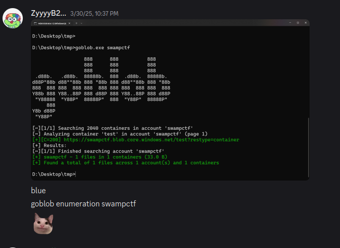

The SwampCTF team is trying to move our infrastructure to the cloud. For now, we've made a storage account called swampctf on Azure. Can you test our security by looking for a flag?

https://github.com/Macmod/goblob

