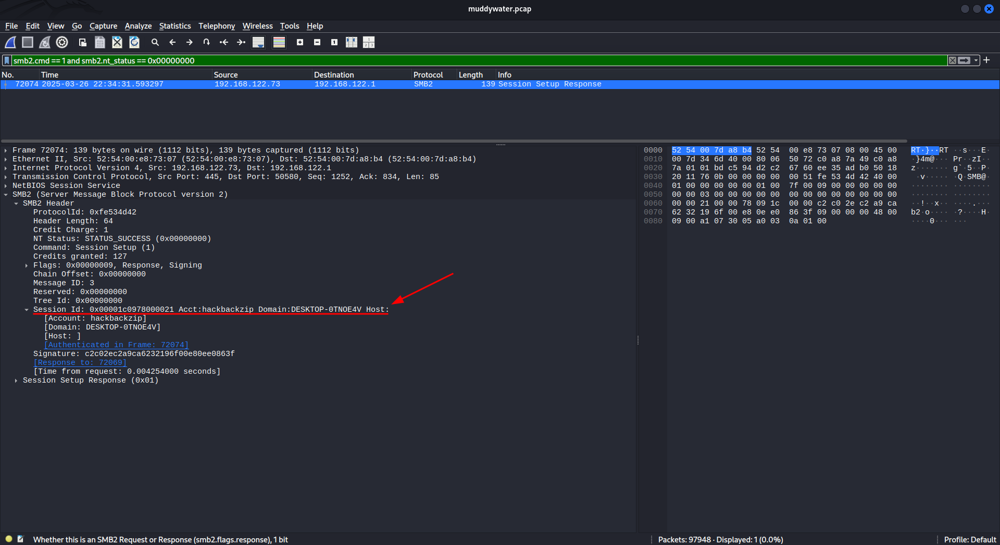
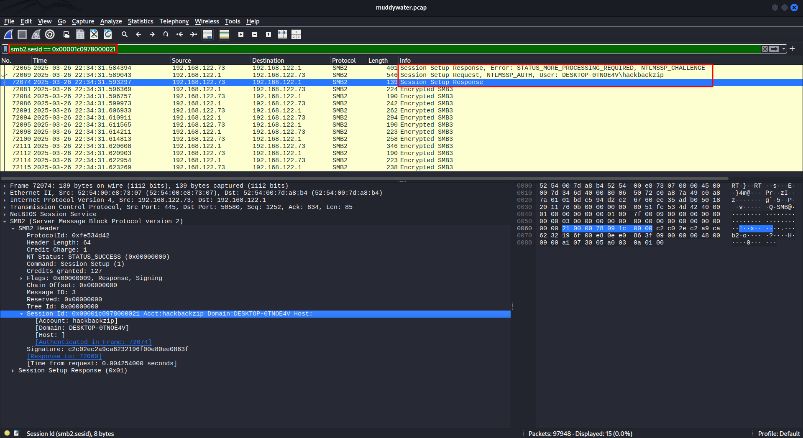
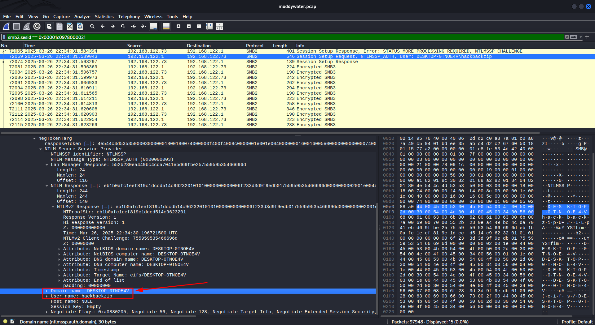
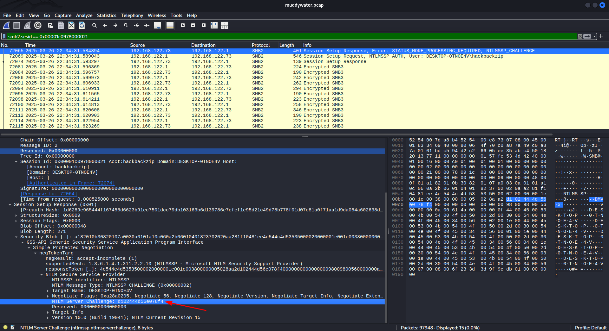
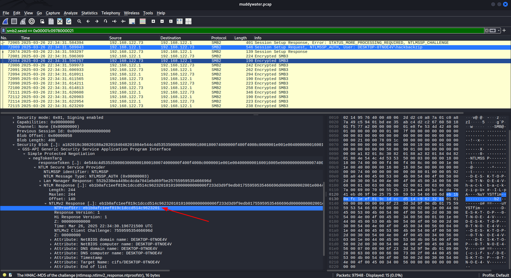
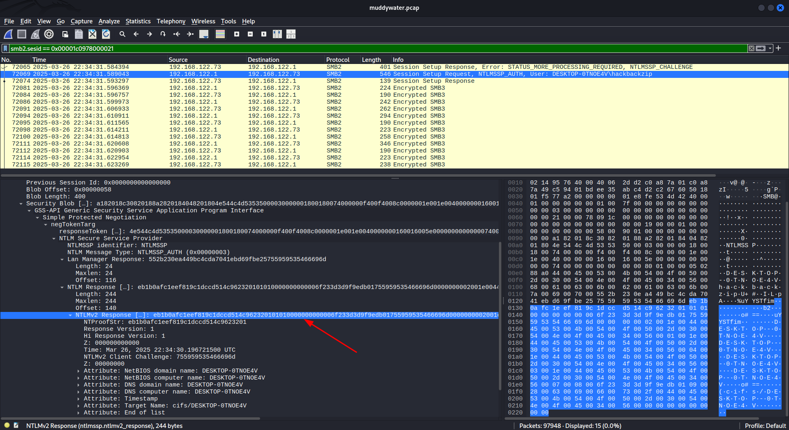

smb2.cmd == 1 and smb2.nt_status == 0x00000000
or smb2.cmd == 0x01 and smb2.nt_status == 0

Credit to https://hackmd.io/@trithong1906/S1NvrQ_T1x

Format hash:

User::Domain:ServerChallenge:NTProofStr:NTLMv2Response

Final:

``hackbackzip::DESKTOP-0TNOE4V:d102444d56e078f4:eb1b0afc1eef819c1dccd514c9623201:01010000000000006f233d3d9f9edb01755959535466696d0000000002001e004400450053004b0054004f0050002d00300054004e004f0045003400560001001e004400450053004b0054004f0050002d00300054004e004f0045003400560004001e004400450053004b0054004f0050002d00300054004e004f0045003400560003001e004400450053004b0054004f0050002d00300054004e004f00450034005600070008006f233d3d9f9edb010900280063006900660073002f004400450053004b0054004f0050002d00300054004e004f004500340056000000000000000000``

Hashcat:

``hashcat -a 0 -m 5600 hash.txt rockyou.txt``
